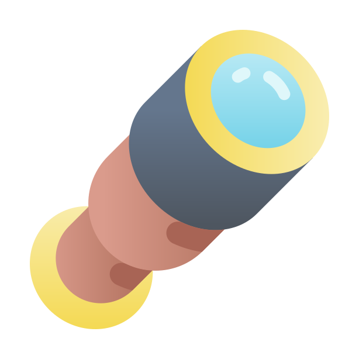

# Spyglass

  

  
  
  
  

  A Kubernetes GUI for all your needs.

## Table of Contents

* [Getting Started](#getting-started)
  * [Prerequisites](#prerequisites)
  * [Installation](#installation)
* [Credits](#credits)
* [License](#license)

## Getting Started

TODO

### Prerequisites

TODO

### Installation

TODO

## Credits

[Icons provided by Freepik - Flaticon](https://www.flaticon.com/free-icons/telescope)
App icon link: [link](https://www.flaticon.com/free-icon/spyglass_2939304)

## License

This project is licensed under the MIT License - see the [LICENSE](LICENSE) file for details.
